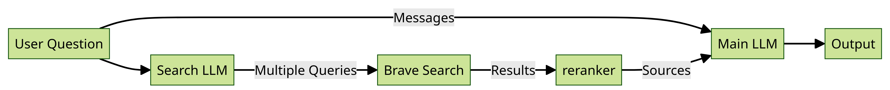

# stepbacksearch

This is a proof of concept for a system that makes multiple searches at once to quickly find an accurate answer to the question asked by the user. This consists of a finetuned language model to generate the search queries and extract the meaning of the user's question or statement, as well as a standard language model to analyze sources and return an answer and a sorting layer to minimize the amount of information the model needs to see.

Training Dataset: sruly/StepBackSearch based on OpenAssistant/oasst1

[demo](https://stepbacksearch.streamlit.app/)

